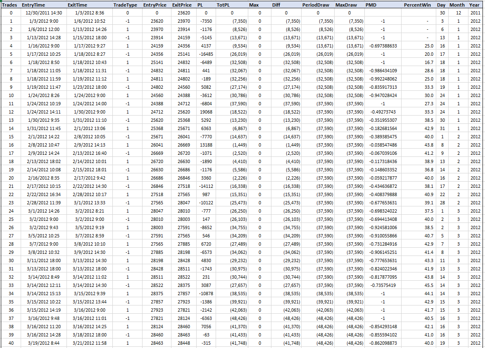

## Introduction
This project is a comprehensive backtesting engine to analyze trading strategies on time series data. 
It has the ability to generate signals, define the logic which will govern trades and report key metrics on strategy performance.

Additionally, the platform offers optimization capability, which allows users to define a range of parameters for intended signals and will test
all possible combinations within the parameters set forth by the user and return comprehensive performance statists on each combination.

Finally, the engine offers a complete cross validation framework which will divide the dataset into a user-defined number of subsets on which to train and test the strategy independently. This reduces likliehood of overfitting data and provides higher likelihood of strategy performance in real practice. A workflow can be seen below:

## File functionality
1. <u><b>position_logic.py</u></b>: Contains code for calculating signals which will be used in the strategy. Also contains logic 
for determining what the entry and exit conditions will be

2. <u><b>backtester.py</u></b>: Logic to take position logic and apply it to time series data. Defines the key performance indicators, statistics and output files

3. <u><b>optimzer.py</u></b> Outlines logic for strategy optimization. Takes user input for parameter range, creates position logic using all possible combinations and outputs file with KPI for each combination

4. <u><b>cross_validation.py</u></b>: Logic for defining the walk forward cross validation. Also contains code for plotting equity curve based on cross validation results.

5. <u><b>time_series_split.py</u></b>: Houses all logic for splitting time series used throughout the engine. Defines 5 different ways to split the series which is used in the backtester, optimzer and cross valdiation.

6. <u><b>moving_linear_regression.py</u></b>: Defines the logic for calculating a moving linear regression, which is the signal used in the backtesting example provided. 
	
## Screenshots

<b>Equity curve:</b>

<b>Aggregated Metrics Output: </b>

<b>Tabulated Trade Backtest Output: </b>

<b>Optimization Output:</b>

<b>Cross Validation Output:</b>

